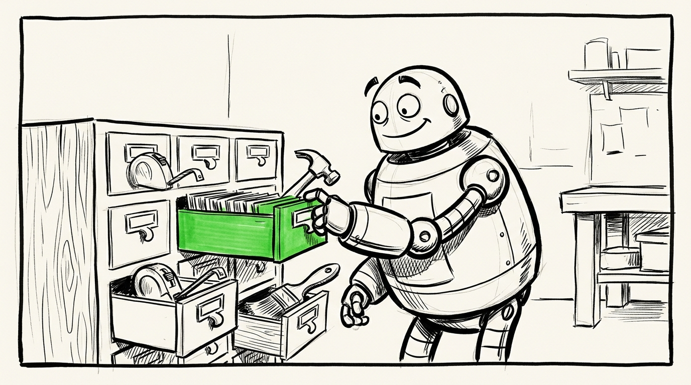

# Claude Code Skills

Two things in one repo:

1. **Spec-driven development** – a complete workflow where specs are the source of truth, code implements specs, and a suite of skills keeps everything in sync. From idea to spec to plan to implementation to review.
2. **General-purpose skills** – tools that make Claude Code smarter regardless of your workflow: session retrospectives, structured interviews, multi-agent debugging, PR automation, and more.

Steal what's useful. Most people point Claude at this repo and cherry-pick what fits their workflow.

> 📘 **Rolling out Claude Code at your organization?** See the [adoption recipes](docs/claude-code-recipes/00-overview.md) – opinionated patterns for project organization, design-to-execution workflow, AI security, and data proxies. Each recipe pairs an approachable description for non-technical readers with a technical reference for Claude.

## Quick start

The fastest path: install as a plugin and run the setup wizard.

```
/plugin install claude-skills@anutron/claude-skills
/claude-skills:setup
```

That gets you everything – skills, rules, hooks, status line – with interactive setup and auto-updates.

Three other paths exist: per-project sandbox (no global install), clone-and-promote (full control), and steal-the-pieces (cherry-pick). See the [quick start guide](docs/quick-start.md) for all four.

---

## The toolkit

Six docs cover how the pieces fit together.

### Workflow guide


How the skills compose into a single development cycle. The skill cascade (brainstorm, execute-plan, ralph-review, spec-audit, bugbash, fixit), what each step produces, how it hands off to the next, and the WHY of specs as the source of truth.

[Read the workflow guide →](docs/workflow-guide.md)

### Spec-driven development


The OpenSpec-based workflow: idea → spec → plan → test → implement → review. The full skill set, setup instructions, and how it degrades gracefully when not all pieces are present.

[Read about spec-driven development →](docs/spec-driven-development.md)

### Skills catalog



The complete index of skills, grouped by purpose – development, discipline and orchestration, git/PR, and general utilities.

[Browse the catalog →](docs/skills-catalog.md)

### Claude rules


Version-controlled CLAUDE.md snippets with a compilation system. Each rule is a small focused snippet that compiles into the final CLAUDE.md – portable, reviewable, and template-variable-aware.

[Read about Claude rules →](docs/claude-rules.md)

### Session topics


The set-topic skill plus the hook that ensures Claude actually uses it. Displays in the [status line](bin/statusline.sh) for easy session identification.

[Read about session topics →](docs/session-topics.md)

### Skill usage tracking


Three hooks that track which skills get invoked and which get loaded as dependencies. Pair with `/skill-audit` for periodic pruning recommendations.

[Read about skill usage tracking →](docs/skill-usage-tracking.md)

---

## Adoption recipes for organizations

A set of opinionated patterns for orgs scaling Claude Code adoption – covers personal workshops, the design-to-execution pipeline, AI security, and data proxies. Each recipe has an approachable orientation up top and a technical reference at the bottom for Claude.

See [docs/claude-code-recipes/](docs/claude-code-recipes/00-overview.md).

---

## Extras

| File | Description |
|------|-------------|
| [docs/permissions-guide.md](docs/permissions-guide.md) | Recommended permission rules – reduce nagging, protect sensitive files, block destructive commands |
| [docs/stack-spectrum.md](docs/stack-spectrum.md) | Tech stack tiers from lightweight to deployable – picking the right size for the job |
| [docs/op-secret.md](docs/op-secret.md) | Lazy 1Password loader for shell env vars – zero startup cost, no secrets on disk ([bin/op-secret.sh](bin/op-secret.sh)) |
| [bin/statusline.sh](bin/statusline.sh) | Custom Claude Code status line – git status, session topic, terminal title |

---

## Plugins I use

| Plugin | Source | What it does |
|--------|--------|-------------|
| **pr-review-toolkit** | `claude-plugins-official` | Comprehensive PR review using specialized agents |
| **commit-commands** | `claude-plugins-official` | Git workflow shortcuts – commit, push, PR creation |
| **github** | `claude-plugins-official` | GitHub MCP integration – issues, PRs, code search |
