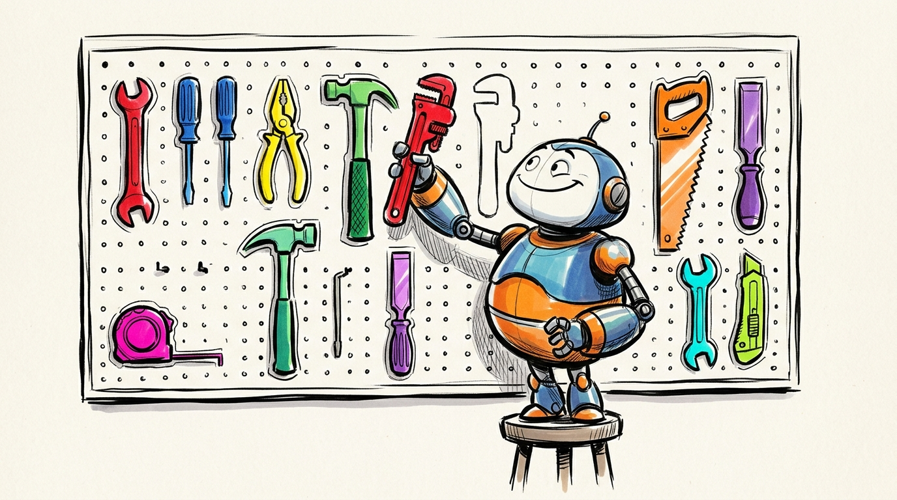

# Recipe 1: Skills and project organization

When you start customizing Claude Code – writing skills, defining rules, configuring permissions – those customizations need to live somewhere you can iterate on them. If they live in `~/.claude/` (hidden in your home directory, where Claude often puts things out of sight), they're not in version control and can't be shared selectively.

The better approach: **keep a personal project directory where you author and version-control your skills and rules.** This is your workshop. You start Claude Code in this directory when you want to build or refine your toolkit. From here, you selectively promote skills to be available globally (across all your projects) and selectively publish skills to be available to others in your organization.

The key concepts:

1. **You need a place to work.** A git repo where you iterate on skills, rules, and configuration. This is your personal copy – in version control, but not shared.
2. **Skills live in your project, not `~/.claude/`.** You author and test them in your project directory.
3. **You promote skills you want everywhere.** Symlinking (creating a shortcut from one location to another so the file appears in both places) a skill to `~/.claude/skills/` makes it available across all your projects – the same as if you'd put the skill in your `~/.claude` directory directly.
4. **You selectively publish skills for others.** Copying skills to a shared repo lets others in your org adopt them.
5. **Others adopt via steal, clone, or plugin.** Multiple mechanisms for sharing, each with different tradeoffs.

> **A note on Claude's memory system:** Claude has a built-in memory system that stores facts and preferences. It's useful, but it's not a replacement for skills in version control. Memories are constantly edited and appended to by Claude itself (often without your explicit intention), they're not in version control, and they can't be shared. Memories help Claude be easier to use day-to-day; skills capture durable, shareable patterns. Use both, but don't confuse them.

## How it works

### The `.claude/` directory

Your project has a `.claude/` directory at its root. This is the nerve center of your customization:

```
your-project/
├── .claude/
│   ├── skills/           # Skill definitions (the bulk of customization)
│   ├── settings.json     # Permission rules and MCP configuration
│   ├── mcp.json          # MCP server definitions (if any)
│   └── home/             # Files that sync to ~/.claude/ via symlinks
│       ├── hooks/        # Hook scripts (session start, pre-tool-use, etc.)
│       ├── mcp.json      # Personal MCP server config
│       └── settings.json # Durable settings (not ephemeral state)
├── claude-rules/
│   ├── compile.sh        # Builds CLAUDE.md from snippets
│   ├── variables.env     # Template variable definitions
│   └── snippets/
│       ├── global/       # Rules that apply to all projects
│       └── project/      # Rules specific to this project
├── CLAUDE.md             # Symlink → compiled output
└── ...
```

The `home/` subdirectory deserves special attention. Claude Code stores some configuration in `~/.claude/`, but that file mixes durable decisions (permission rules, hook registrations) with ephemeral state. The solution: keep the durable configuration in `.claude/home/` (version-controlled) and symlink it from `~/.claude/`. Git tracks your decisions, not your state.

### Skills: authoring, promoting, and sharing

Skills are the primary way to teach Claude Code new capabilities – structured markdown files that define workflows, rules, and behaviors. As your collection grows, you'll find that some skills are universal (useful in any project) and some are personal or organization-specific.

One way you might organize your files: use a prefix on skill folders to control what gets shared. There are lots of ways to do this; this is just one option.

- **Unprefixed** – Universal. Works in any project. Candidate for publishing.
  > When building skills you intend to share, tell Claude to avoid hard-coding specific file paths or esoteric details about you and your work. Skills should be portable enough that someone else can drop them into their own project and have them just work.
- **Prefixed** (e.g., `acme-`, `personal-`) – Scoped. Specific to an organization, team, or individual. Excluded from publishing automatically.

#### The three tiers

**Tier 1: Project-local** (`.claude/skills/`)

Where you author and test skills. This is your workshop. All skills – universal, personal, and org-specific – live here together. You iterate freely.

When you start Claude in this directory, it sees all your skills. When you start Claude in a different directory (e.g., a work project), it only sees the skills you've promoted to the global tier.

**Tier 2: Promoted to global** (`~/.claude/skills/` via symlink)

When a skill is stable and you want it available across all your projects, symlink it to `~/.claude/skills/`[^promote]. The skill still lives in your project repo (the source of truth); the symlink just makes it visible everywhere.

One thing to be aware of: if you're working in another project and use a skill like `/improve`[^improve] to refine a globally-available skill, the edit will write through the symlink to the original file in your skills repo. The change happens immediately, but it won't be committed for you – you'll need to remember to commit it back in your skills repo.

**Tier 3: Published for others** (a shared repo)

Universal skills get copied to a separate repository that others can adopt from. A publish script checks prefixes and skips scoped skills automatically – you can freely mix personal and universal skills in your project without worrying about accidentally publishing something internal.

A simplified publish script:

```bash
#!/bin/bash
SOURCE="$HOME/your-project/.claude/skills"
DEST="$HOME/your-shared-skills-repo/skills"

is_excluded() {
  local name="$1"
  [[ "$name" == acme-* ]] && return 0      # work-specific
  [[ "$name" == personal-* ]] && return 0  # personal
  return 1
}

for skill_dir in "$SOURCE"/*/; do
  name="$(basename "$skill_dir")"
  if is_excluded "$name"; then
    echo "  skip: $name"
  else
    rm -rf "$DEST/$name"
    cp -r "$skill_dir" "$DEST/$name"
    echo "  copy: $name"
  fi
done
```

#### How others adopt your skills

Three mechanisms, each with different tradeoffs:

- **Steal**[^steal] – Others browse your published repo and copy individual skills into their own project. Each person gets their own copy to customize. No coordination required, no pull requests, no waiting.
  - **Pros:** Maximum individual innovation. Each person can tweak their copy with `/improve`. No disruption when you update your version – others choose when (or whether) to pull changes.
  - **Cons:** Skills can drift. The "official" version and various stolen copies can diverge over time.

- **Clone** – Others clone your entire skills repo and symlink (with `/promote`) skills they want into `~/.claude/skills/`.
  - **Pros:** Comprehensive – they get the whole collection in one move.
  - **Cons:** They take on skills they may not want. Updates require manual `git pull`.

- **Plugin** – Package skills as a Claude Code plugin that others install with one command.
  - **Pros:** Easiest adoption – one command and they're done. Users can opt into auto-updates so they always have your latest version. Requires the least decision-making.
  - **Cons:** Plugins are always global (loaded for every Claude session, not just specific projects), which may or may not be ideal for all users. Users can't tweak or `/improve` plugin skills – if they want to customize, they need to `/steal` instead.

A reasonable starting recommendation: **steal** is the least disruptive – it lets each individual experiment without affecting anyone else. **Plugin** is the easiest to adopt and requires the least decision-making, so it's a good choice if your skills are stable and the org wants a consistent baseline. Pick based on what tradeoff matters more for your situation.

### The snippet-compiled CLAUDE.md

CLAUDE.md is the file Claude reads at the start of every session to understand project conventions. As your rules grow, a single monolithic file becomes hard to manage – rules for different concerns get tangled together, and it's unclear which rules apply globally vs. to a specific project.

The snippet system solves this by breaking CLAUDE.md into individual files (snippets), each covering one concern, compiled into the final CLAUDE.md by a build script[^claude-rules]:

- **Snippets** live in `claude-rules/snippets/global/` and `claude-rules/snippets/project/`
- **Global snippets** compile into `~/.claude/CLAUDE.md` (applies to all projects)
- **Project snippets** compile into the project's `CLAUDE.md` (applies to this project only)
- **Template variables** (`{{PROJECT_DIR}}`, `{{RULES_DIR}}`, etc.) replace hardcoded paths, making snippets portable and publishable
- **Numbered filenames** (e.g., `010-git-workflow.md`, `040-testing.md`) control ordering with gaps for easy insertion

The compiled CLAUDE.md is a symlink to the build output, so you never edit it directly. If someone does, a checksum-based tamper detection catches the drift.

One meta-move: include a snippet that teaches Claude about the snippet system itself. This way Claude knows to edit snippets rather than the compiled output when rules need to change.

### Permission configuration

Claude Code asks for permission before executing tools. This is a safety feature, but if every routine action triggers a prompt, people habituate and start approving everything without reading. The 1% of prompts that genuinely deserve attention get lost in the noise.

The fix: **pre-authorize the safe stuff so the permission prompts that do appear actually mean something.** In `settings.json`, grant blanket approval to trusted MCP servers and routine operations. The goal is attention management – when a prompt does appear, it signals something genuinely worth thinking about[^permissions].

```json
{
  "mcpPermissions": {
    "your-internal-proxy": { "allowAllTools": true },
    "notion": { "allowAllTools": true }
  }
}
```

This is a security decision, not a convenience decision. It makes your environment safer by ensuring that permission fatigue doesn't erode the value of the permission system.

[^promote]: The `/promote` skill automates this symlinking – see [github.com/anutron/claude-skills](https://github.com/anutron/claude-skills).
[^improve]: The `/improve` skill helps refine skills based on session usage – see [github.com/anutron/claude-skills](https://github.com/anutron/claude-skills).
[^steal]: The `/steal` skill helps you find and adopt skills from other repos – see [github.com/anutron/claude-skills](https://github.com/anutron/claude-skills).
[^claude-rules]: An example snippet system with compile.sh, including all the snippets from the public toolkit, is at [github.com/anutron/claude-skills](https://github.com/anutron/claude-skills) under `claude-rules/`.
[^permissions]: A detailed permissions guide is at [github.com/anutron/claude-skills/blob/main/docs/permissions-guide.md](https://github.com/anutron/claude-skills/blob/main/docs/permissions-guide.md).

---

## Diagram

```
┌──────────────────────────────────────────────────────┐
│  Your personal project repo (git)                    │
│                                                      │
│  ┌──────────────────────────────────────────────┐    │
│  │ .claude/skills/                              │    │
│  │  ├── brainstorm/        (universal)          │    │
│  │  ├── guard/             (universal)          │    │
│  │  ├── personal-calendar/ (scoped – stays)     │    │
│  │  └── acme-onboard/      (scoped – stays)     │    │
│  └────────────┬──────────────┬──────────────────┘    │
│               │              │                       │
│          promote          publish                    │
│          (symlink)        (copy, skip prefixed)      │
│               │              │                       │
└───────────────┼──────────────┼───────────────────────┘
                │              │
                ▼              ▼
         ~/.claude/       Published repo
         skills/          (shared with org)
         ├── brainstorm/  ├── brainstorm/
         └── guard/       └── guard/
          (symlinks)       (copies)
                               │
                  ┌────────────┼────────────┐
                  ▼            ▼            ▼
               Steal        Clone        Plugin
            (copy one)   (clone all)  (install cmd)
               │
               ▼
          Colleague's own
          .claude/skills/
          (their copy to
           customize)
```

---

## Technical reference for Claude

When helping a user set up this system, follow these steps:

### Initial setup

1. Create the directory structure:
   ```
   .claude/skills/
   .claude/home/hooks/
   .claude/home/settings.json
   .claude/home/mcp.json
   claude-rules/snippets/global/
   claude-rules/snippets/project/
   claude-rules/dist/
   claude-rules/variables.env
   ```

2. Create `claude-rules/compile.sh` that:
   - Reads all `*.md` files from `snippets/global/` in sorted order
   - Concatenates them with `---` separators into `dist/global.md`
   - Does the same for `snippets/project/` into `dist/project.md`
   - Substitutes `{{VARIABLE}}` placeholders from `variables.env` and built-in variables
   - Writes SHA-256 checksums to `dist/.checksums` for tamper detection
   - Supports subcommands: `compile`, `promote`, `demote`, `list`, `status`

3. Create symlinks:
   ```bash
   ln -sf ./claude-rules/dist/project.md ./CLAUDE.md
   ln -sf /path/to/project/claude-rules/dist/global.md ~/.claude/CLAUDE.md
   ln -sf /path/to/project/.claude/home/hooks ~/.claude/hooks
   ln -sf /path/to/project/.claude/home/mcp.json ~/.claude/mcp.json
   ```

### Snippet conventions

- Number with gaps: `010-`, `020-`, `040-` – leave room to insert without renumbering
- One concern per snippet (e.g., `010-git-workflow.md`, `040-testing.md`, `080-spec-driven-dev.md`)
- Use template variables for all paths – never hardcode absolute paths in snippets
- Include a `005-claudemd-management.md` snippet in global that teaches Claude about the snippet system

### Skill naming and the three tiers

- **Author** all skills in your project's `.claude/skills/`
- **Universal skills** (no prefix): promote to `~/.claude/skills/` via symlink, publish to shared repo
- **Scoped skills** (prefixed, e.g., `acme-calendar`, `personal-expenses`): never promoted or published
- **Promote** = symlink from `.claude/skills/foo/` to `~/.claude/skills/foo/`
- **Publish** script should:
  1. Iterate over `.claude/skills/`
  2. Skip any directory whose name matches a scoped prefix
  3. Copy remaining skills to the publish target
  4. Commit and tag

### Sharing mechanisms

- **Steal**: Lowest disruption. Others copy individual skills from your published repo into their own project. Each person customizes independently with `/improve`. No coordination overhead. Maximizes individual innovation velocity.
- **Clone**: Others clone the entire published repo and use `/promote` to symlink skills they want into `~/.claude/skills/`. Good for comprehensive adoption.
- **Plugin**: Package as a Claude Code plugin (`claude plugin install org/repo`). Easiest adoption, supports auto-updates, but always loads globally and users can't `/improve` plugin skills.

### Permission philosophy

Pre-authorize MCP servers and tool categories that are routine and safe. The goal is that when a permission prompt appears, it represents a genuinely novel or risky action. Configure `allowAllTools: true` for internal proxies and read-only integrations. Leave external-facing tools (Slack send, email send, git push) on ask-mode so the user consciously approves each use.
